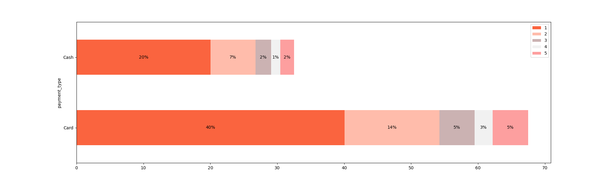

# Hypothesis Testing on Taxi Trips: Understanding Payment Type & Fare Patterns

This project analyzes how payment type (Card vs Cash) influences fare amount, trip distance, and passenger patterns.
Hypothesis testing and visual analysis are used to find insights that can help drivers and platforms increase revenue.

### Project Overview

This analysis inspects NYC taxi trip data (subset) to determine whether payment method influences fare amount and trip distance. The end goal is to suggest ways to maximize driver revenue by nudging customers toward payment methods that yield higher average fares.

### 📁 Dataset Features

-- payment_type (Card, Cash)
-- fare_amount
-- trip_distance
-- passenger_count
-- Dates & time stamps

📊 Visualization Section
1️⃣ Fare Amount by Payment Type (Boxplot)
This plot shows how fare amounts vary for Card and Cash payments.
Card payments generally have slightly higher median fares.

### Fare Amount by Payment Type

2️⃣ Distribution of Fare Amount & Trip Distance

These histograms compare Card vs Cash for fare amount and trip distance.
Card trips show higher frequency for mid–high fare ranges.

### 2️⃣ Distribution of Fare Amount & Trip Distance

3️⃣ Passenger Count Distribution (Stacked Bar)

Shows how passenger count varies between Card and Cash trips.
Single-passenger rides dominate, but card usage is higher across all groups.

### Passenger Count Distribution

4️⃣ Payment Preference (Pie Chart)

Shows overall preference between Card and Cash.
Card is clearly more preferred (~67%).

### 4️⃣ Payment Preference

### 🧪 Hypothesis Testing

Null Hypothesis (H₀): 
There is no difference in average fare between Card and Cash trips.

Alternative Hypothesis (H₁):
There is a difference in average fare between Card and Cash trips.

Result:

t-statistic: Very high
p-value: < 0.05
    ✔ Reject H₀

Conclusion: Card payments have significantly higher average fares than Cash.

### 🔍 Key Insights

✔ Card trips have higher average fares
Card users spend more per trip than cash users.

✔ Card trips are slightly longer
Distance distribution shows card trips trending higher.

✔ Majority of passengers prefer card payments
Approx. 67.5% choose Card and 32.5% choose Cash.

✔ Single-passenger trips dominate
But card still has better distribution for revenue.

### 💡 Business Suggestions

✔ Encourage Card payments using small incentives.

✔ Promote easy card payment features in the app.

✔ Target long-distance ride promotions for card users.

✔ Track revenue changes after implementing incentives.

### 🧾 Conclusion

Payment type directly influences fare revenue.
Card payments consistently result in higher fares and longer trips.
Supporting card adoption can increase total revenue without changing pricing.

📘 Project Files

Notebook: Hypothesis Testing (Maximizing Revenue).ipynb
PDF Report: yello_trip_data_hypothesis_testing.pdf
All visualizations in images/ folder

### 📜 Technologies Used

Python
Pandas
Matplotlib
Seaborn
Jupyter Notebook

